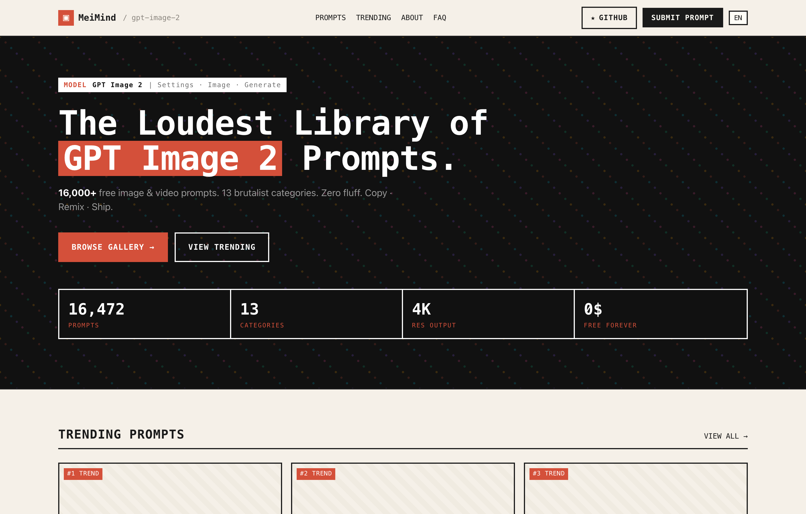
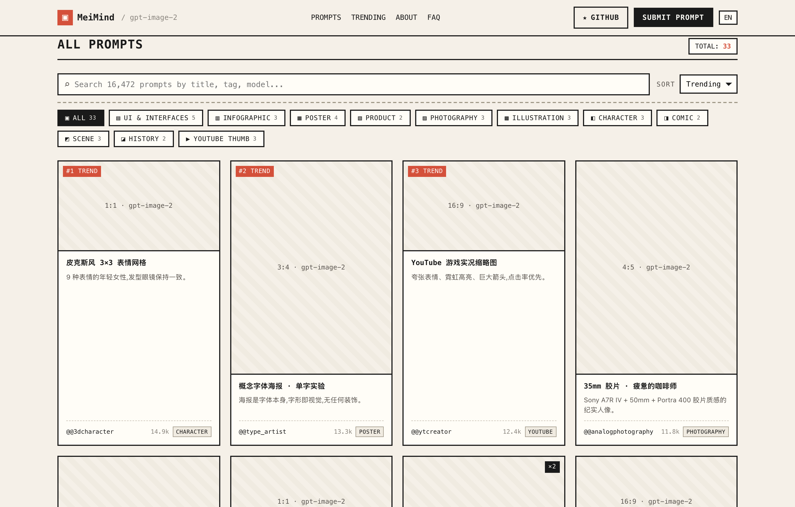
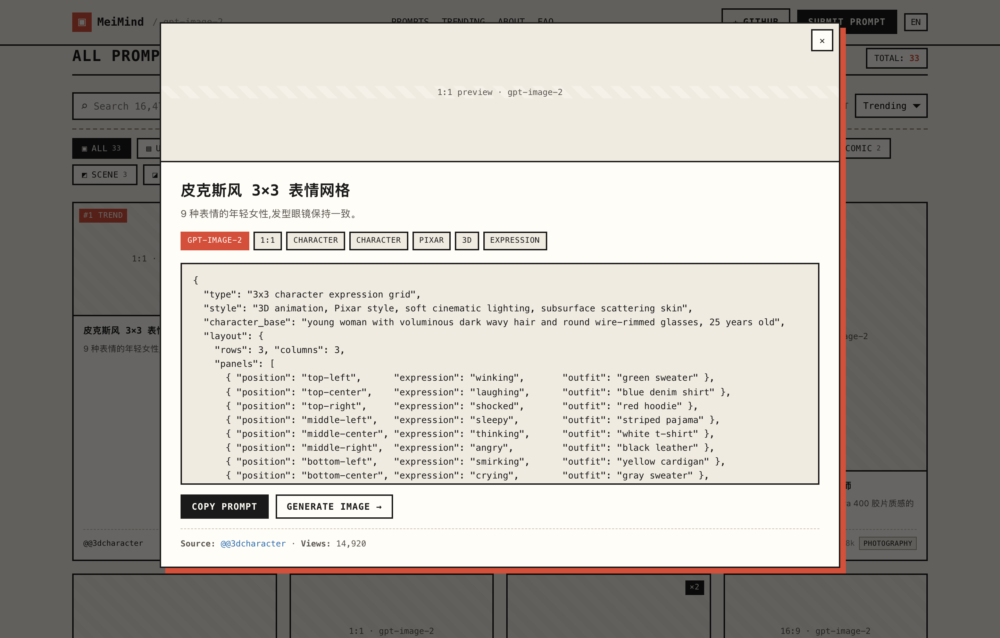
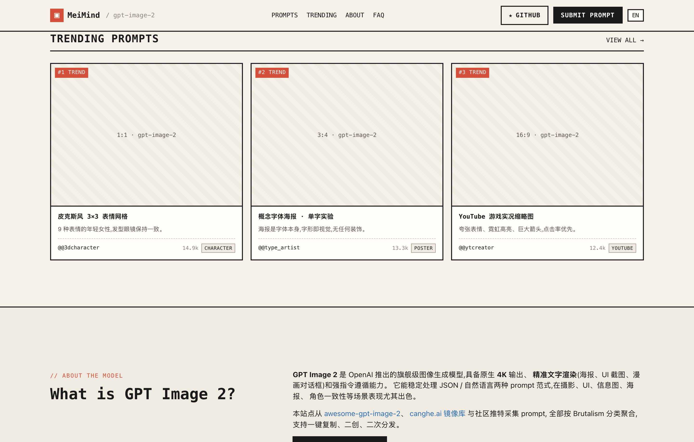

<div align="center">

# ▣ MeiMind · GPT Image 2 Prompts Gallery

**专为 GPT Image 2 打造的新野蛮主义（Neo-Brutalism）提示词与灵感画廊**

16,000+ 免费图像与视频 Prompt 灵感 · 13 大严选分类 · 一键复制 · 极速零依赖

[](https://creativecommons.org/licenses/by/4.0/)
[](#技术架构)
[](vercel.json)

---



</div>

---

## 🌟 项目亮点 (Highlights)

- 🎨 **新野蛮主义设计语言（Neo-Brutalism）**：粗边框、硬阴影、等宽字符排版（Monospace UI），纯粹、克制、无废话。
- ⚡ **零框架、零构建、超轻量**：纯 HTML5 + 现代化原生 CSS + 原生 Vanilla JS，首屏毫秒级秒开。
- 🗂 **13 大垂直场景分类**：涵盖 UI & 界面设计、摄影 (35mm/RAW)、信息图 (Infographic)、概念海报、3D 角色网格、漫画分镜、YouTube 封面等。
- 🔍 **毫秒级实时搜索与筛选**：支持按标题、标签、模型、宽高比及热度多维度即时过滤排序。
- 📋 **沉浸式卡片与详情弹窗**：提供完整结构化 JSON / 自然语言 Prompt 预览，一键复制（Clipboard API）与二创分发。
- 📱 **全终端自适应响应式**：从 4K 大屏到移动端设备均具备良好的阅读与交互体验。

---

## 📸 产品界面展示 (Screenshots)

### 1. 首页与画廊检索区 (Hero & Gallery Search)
> 聚合全局检索条、13 类分类标签筛选 Pill，以及带有热度标签的瀑布流卡片网格。



---

### 2. 结构化 Prompt 详情弹窗 (Modal & Detail View)
> 点击卡片即时弹出详情，高亮显示 Aspect Ratio、模型参数、标签、源作者，并支持一键复制完整 Prompt。



---

### 3. 热门推荐专区 (Trending Prompts)
> 精选社区高热度、高点赞 Prompt，快速激发创作灵感。



---

## 📂 目录结构 (Project Structure)

```text
prompt-gallery/
├── index.html                  # 页面结构 (语义化 HTML5)
├── style.css                   # 新野蛮主义样式体系 (Design Tokens + Layout)
├── app.js                      # 核心业务逻辑 (原生 JS 数据加载、过滤、渲染、弹窗)
├── vercel.json                 # Vercel 静态托管路由与缓存配置
├── .gitignore                  # Git 忽略配置
├── data/
│   └── prompts.json            # Prompt 数据库 (分类元数据、结构化 prompt 集合)
├── assets/
│   └── favicon.svg             # 矢量站点图标
├── docs/
│   └── images/                 # 项目展示配图 (Hero, Gallery, Modal, Trending)
└── scripts/
    └── capture-screenshots.mjs # 自动化截图生成脚本 (基于 Chrome DevTools Protocol)
```

---

## 🚀 快速上手 (Quick Start)

由于本项目无需任何 Node.js 编译或 Webpack/Vite 构建流程，直接通过任意静态 HTTP 服务器即可运行：

### 方式 1：Python 极速启动（推荐）

```bash
# 进入项目根目录
cd prompt-gallery

# 启动本地 HTTP 服务
python3 -m http.server 8000
```
打开浏览器访问 `http://localhost:8000` 即可。

### 方式 2：使用 Node.js / npx serve

```bash
npx serve .
```

### 方式 3：VS Code Live Server
在 VS Code 中安装 **Live Server** 插件，右键 `index.html` 选择 **"Open with Live Server"**。

---

## 🛠 技术架构与实现 (Tech Stack)

- **UI / CSS**：原生 CSS3 Variables 自定义主题变量、CSS Grid / Flex 响应式排版、Neo-Brutalism 硬朗阴影与色彩体系。
- **JavaScript**：ES6+ 模块化写法、原生 Fetch API 异步流式加载、防抖搜索（Debounce）、无依赖 Toast & Modal 状态机。
- **数据源设计**：解耦的 `data/prompts.json` 架构，支持轻松接入后端 API 或自动化抓取管线。

---

## 🌐 部署指南 (Deployment)

### 部署到 Vercel
本项目已内置 [`vercel.json`](vercel.json)，已配置静态资源高缓存与根路径重定向：

[](https://vercel.com/new)

```bash
# 或使用 Vercel CLI
npx vercel
```

### 部署到 GitHub Pages
1. 在 GitHub 仓库进入 **Settings -> Pages**；
2. **Build and deployment** Source 选择 `Deploy from a branch`；
3. Branch 选择 `main` / `root`，点击 **Save** 即可。

---

## 🤝 贡献与提交 (Contributing)

欢迎提交新的 Prompt 灵感或优化功能！
1. Fork 本仓库；
2. 在 `data/prompts.json` 中新增或修改你的 Prompt 条目；
3. 提交 PR，经测试无误后将在 24 小时内合并。

---

## 📄 开源协议 (License)

- 代码部分基于 [MIT License](LICENSE) 开源。
- 提示词与内容数据遵循对应源社区的 [CC-BY-4.0](https://creativecommons.org/licenses/by/4.0/) 协议。

---

<div align="center">
  <sub>Built with ❤️ & Brutalism by <a href="https://github.com/pepedesigner">@pepedesigner</a></sub>
</div>
